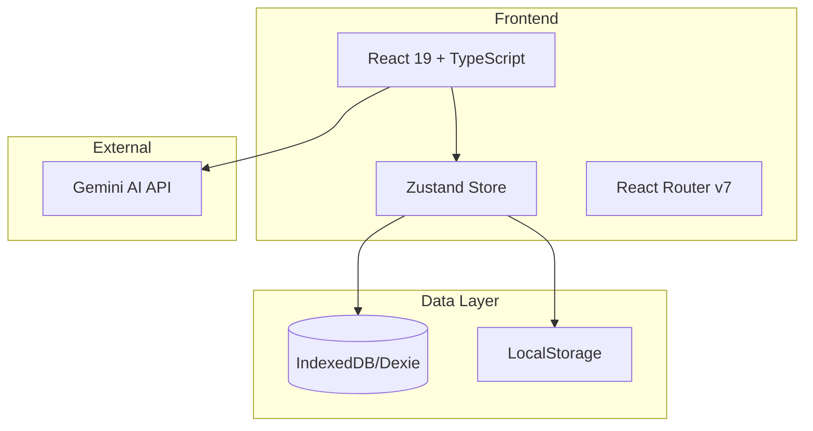

# Prompt Master - CodeWiki

> 🚀 快速、輕量、自動化的個人 Prompt 管理工具

## 專案概述

Prompt Master 是一個現代化的桌面級 Web 應用，用於管理、組織和使用 AI Prompt。核心特色包括：

- **智慧分析**：整合 Gemini AI 自動分析 Prompt 內容
- **變數引擎**：支援 `{{variable}}` 語法的動態變數系統
- **本地優先**：使用 IndexedDB 確保資料隱私
- **零設定**：開箱即用，無需後端

---

## 技術架構



### 技術棧

| 層級 | 技術 | 版本 |
|------|------|------|
| 框架 | React | 19.2.0 |
| 語言 | TypeScript | 5.9.3 |
| 建置工具 | Vite | 7.2.4 |
| 狀態管理 | Zustand | 5.0.9 |
| 資料庫 | Dexie (IndexedDB) | 4.2.1 |
| UI 圖標 | Lucide React | 0.561.0 |
| AI 整合 | Google Generative AI | 0.24.1 |

---

## 專案結構

```
prompt-master/
├── src/
│   ├── pages/
│   │   └── HomePage.tsx      # 主頁面元件 (~260 行)
│   ├── services/
│   │   ├── db.ts             # IndexedDB 資料庫定義
│   │   └── gemini.ts         # Gemini AI 整合
│   ├── stores/
│   │   └── promptStore.ts    # Zustand 狀態管理
│   ├── types/
│   │   └── index.ts          # TypeScript 類型定義
│   ├── data/
│   │   └── samplePrompts.ts  # 範例 Prompt 資料
│   ├── App.tsx               # 根元件
│   └── main.tsx              # 應用進入點
├── .env.example              # 環境變數範本
├── Dockerfile                # Docker 容器定義
└── nginx.conf                # Nginx 設定 (生產環境)
```

---

## 資料模型

### Prompt

```typescript
interface Prompt {
  id: string;
  title: string;
  description: string;
  content: string;
  tags: string[];
  category: 'Coding' | 'Writing' | 'Marketing' | 'Image' | 'Research' | 'Productivity' | 'Creative' | 'Other';
  model: 'ChatGPT' | 'Claude' | 'Gemini' | 'All';
  mode: 'text' | 'image' | 'code' | 'agent';
  variables: Variable[];
  isFavorite: boolean;
  isNSFW: boolean;
  source: 'local' | 'community' | 'synced';
  createdAt: string;
  updatedAt: string;
}
```

### Variable

```typescript
interface Variable {
  name: string;
  description: string;
  defaultValue?: string;
  type: 'text' | 'textarea' | 'select' | 'number';
  options?: string[];
  required: boolean;
}
```

### Collection

```typescript
interface Collection {
  id: string;
  name: string;
  description: string;
  icon: string;
  color: string;
  promptIds: string[];
  isVirtual: boolean;
  createdAt: string;
}
```

---

## 核心功能

### 1. Prompt 管理
- **CRUD 操作**：新增、檢視、編輯、刪除 Prompt
- **收藏功能**：快速標記重要 Prompt
- **分類系統**：依分類/標籤/來源篩選

### 2. AI 智慧分析
- **自動標籤**：分析內容產生相關標籤
- **標題生成**：自動產生簡短標題
- **變數偵測**：識別 `{{variable}}` 格式變數

### 3. 變數引擎
- **變數解析**：解析 Prompt 中的變數
- **動態表單**：根據變數類型生成輸入表單
- **內容編譯**：將使用者輸入替換至 Prompt

### 4. 匯入/匯出
- **JSON 格式**：完整資料備份
- **Markdown 格式**：人類可讀格式匯出

---

## 開發指南

### 環境設定

```bash
# 1. 安裝依賴
npm install

# 2. 設定環境變數
cp .env.example .env
# 編輯 .env 設定 VITE_GEMINI_API_KEY

# 3. 啟動開發伺服器
npm run dev
```

### 可用指令

| 指令 | 說明 |
|------|------|
| `npm run dev` | 啟動開發伺服器 |
| `npm run build` | 建置生產版本 |
| `npm run lint` | 執行 ESLint 檢查 |
| `npm run preview` | 預覽生產版本 |

### 程式碼規範

- 使用 TypeScript 嚴格模式
- 遵循 ESLint 規則
- 元件使用 Functional Components
- 狀態管理使用 Zustand

---

## API 參考

### Gemini Service

#### `analyzePrompt(content: string): Promise<AnalysisResult>`
分析 Prompt 內容，回傳標題、描述、標籤等資訊。

#### `analyzeUserInput(promptContent, userInput, variables): Promise<Record<string, string>>`
根據使用者輸入智慧填入變數值。

#### `suggestTags(content: string): Promise<string[]>`
建議相關標籤。

---

## 部署

### Docker

```bash
docker build -t prompt-master .
docker run -p 80:80 prompt-master
```

### Cloud Run

```bash
gcloud run deploy prompt-master \
  --source . \
  --platform managed \
  --region asia-east1 \
  --allow-unauthenticated
```

---

## 授權

MIT License
